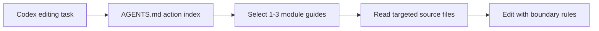
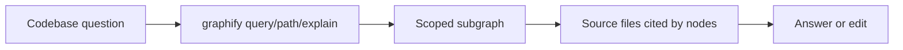

# Code Project Guidance Map vs graphify 评测报告

评测日期：2026-07-01
评测目录：`D:\project\test\graphify-cpgm-benchmark`
当前插件：`code-project-guidance-map` generator `0.2.1`, guide format `action-map:v3`, repo HEAD `872c96d`
graphify：`graphifyy 0.9.3`, GitHub HEAD `69b3997`

## 结论先行

| 结论项 | Code Project Guidance Map | graphify |
| --- | --- | --- |
| 核心定位 | 给 Codex 留一份可验证、可增量刷新的项目编辑地图。 | 把代码/文档语料抽成可查询的知识图谱。 |
| 最适合 | 后续 agent 要快速判断“该读哪个模块、该改哪里、哪些边界不能破坏”。 | 要查调用/依赖/概念路径、做跨文件问答、用图查询压缩上下文。 |
| 落地形态 | `AGENTS.md` 小索引 + `.agents/guidance-map/guides/**/*.md` 懒加载模块指南，各产物独立短自哈希。 | `graphify-out/graph.json` + `GRAPH_REPORT.md` + 可选 HTML/MCP/IDE hook。 |
| 首次产出速度 | `verify` 0.46-0.71s；Spring 小样本完整生成 6m14s，生成 `AGENTS.md` 8.6 KB + 5 个 module guide 10.2 KB。初次默认 CLI 失败已定位为 Windows `codex.CMD` shim 启动问题。 | AST-only 全流程 2.65s/5.78s/23.92s/64.30s，随仓库规模增长。 |
| Token/上下文 | 脚本校验不耗 LLM token；Spring 完整生成日志为 `input_tokens=870,007`，其中 `cached_input_tokens=802,944`，`output_tokens=11,904`，`reasoning_output_tokens=3,976`。消费侧目标是只读 `AGENTS.md` + 1-3 个模块 guide。 | AST-only `input_tokens=0/output_tokens=0`；query 输出约 362-950 token；自带 benchmark 估算查询比全量上下文少 10.4x-23.7x。 |
| 安装难度 | Codex 插件市场安装，强绑定 Codex；生成路径要求 builder 与子代理能力。 | `uvx`/`uv tool install` 即可跑 CLI，平台覆盖广；全仓库 headless 遇到 docs/image 需要 LLM backend/API key 或宿主 agent 语义抽取。 |
| 最大优势 | 面向“编辑决策”的 compact project memory，签名、freshness、单 builder 租约和增量刷新语义清晰。 | 面向“图检索”的机器可遍历结构，跨语言 AST 抽取快，查询上下文可控。 |
| 最大短板 | 完整生成依赖 Codex builder/subagent；速度和 token 不像 graphify AST-only 那样 deterministic，Windows CLI shim 需要启动兼容处理。 | graph 数据大、需维护 `graphify-out`；headless docs 语义抽取有 key/模型前置条件；raw graph 与 `benchmark` 命令存在格式兼容坑。 |

一句话：两者不是同类替代品。当前插件把项目知识落到 Codex 的编辑入口，强调“少读、读对、可验证”；graphify 把项目内容落到图数据库式产物，强调“可查、可遍历、可压缩上下文”。如果要组合使用，建议让 `AGENTS.md` 保持轻量路由，把 graphify 作为深查工具，而不是把 graph JSON 塞进启动上下文。

## 同维度差异矩阵

| 对比维度 | Code Project Guidance Map 优势 | Code Project Guidance Map 劣势 | graphify 优势 | graphify 劣势 | 落地差异 |
| --- | --- | --- | --- | --- | --- |
| 核心目标 | 直接服务 Codex 编辑决策，回答“该读哪里、改哪里、哪些边界别碰”。 | 不擅长回答精确调用链、符号邻居和跨文件路径问题。 | 直接服务代码知识检索，回答“谁依赖谁、相关节点在哪里”。 | 查询结果还需要 agent 再判断哪些内容能转化为编辑规则。 | 当前插件是编辑路由协议；graphify 是检索索引。 |
| 主产物 | `AGENTS.md` 会被 Codex 自然读取，模块 guide 可懒加载。 | Markdown 产物依赖生成质量，不是机器完整结构图。 | `graphify-out/graph.json` 可被 CLI/MCP/IDE 工具遍历。 | graph JSON 大，不适合作为启动上下文直接读。 | 当前插件落到默认工作流入口；graphify 落到工具查询入口。 |
| 网络/格式 | action-map 人类可读，包含编辑规则、任务路由、模块签名。 | 不是图结构，不能做路径算法、邻居扩展或图查询。 | 节点/边格式表达 `contains/imports/references/calls` 等关系。 | v0.9.3 raw graph 和 `benchmark` 存在 `edges`/`links` 格式兼容坑。 | 当前插件保留决策语义；graphify 保留结构关系。 |
| 粒度 | 模块/路径/责任边界粒度适合约束后续改动。 | 粒度较粗，无法替代读源文件或符号级分析。 | 文件、类、函数、方法、类型、manifest 等粒度更细。 | 细粒度会带来更多噪声，复杂仓库 query 命中可能过宽。 | 当前插件少读但粗；graphify细查但要筛。 |
| 首次速度 | `verify` 对新仓库 0.46-0.71s 即可判断缺失/过期。 | 完整生成依赖 Codex builder；Spring 小样本实测 6m14s，不能外推为稳定本地扫描速度。 | AST-only 全流程随规模为 2.65s 到 64.30s，速度可直接量化。 | docs/image semantic extraction 没有 backend/API key 时会失败。 | 校验速度当前插件快；结构抽取速度 graphify 更可预测。 |
| Token 消耗 | `verify` 0 LLM token；后续任务目标是只读 `AGENTS.md` + 1-3 个 guide。 | 首次生成消耗 Codex builder token；Spring 小样本日志 `input_tokens=870,007`、`output_tokens=11,904`。 | code-only AST 抽取 0/0 LLM token；query 输出约 362-950 token。 | 文档/图片语义抽取需要模型；benchmark token 是估算，不是账单。 | 当前插件把 token 花在“生成可复用编辑记忆”；graphify 把上下文压到“按需 query”。 |
| 上下文占用 | `AGENTS.md` 8.6 KB，5 个 module guide 共 10.2 KB，天然分层。 | 如果 `AGENTS.md` 写太长，会伤害每次 Codex 启动上下文。 | query 返回局部子图，避免把大仓库一次性塞进上下文。 | Hangfire `graph.json` 13.28 MB，直接读会淹没上下文。 | 当前插件靠懒加载 Markdown 控制上下文；graphify靠 query 控制上下文。 |
| 代码规模适配 | 大仓库可以通过模块 guide 分层，把编辑入口保持小。 | 本次完整生成只复跑了 Spring 小样本，中/大仓库端到端数据不足。 | 小中大样本均完成 AST-only 图抽取，规模增长趋势清晰。 | graph 文件体积和节点数随仓库增大明显上升。 | 当前插件理论上靠分层扩展；graphify实测抽取可扩展但产物会变大。 |
| 复杂结构适配 | 能把复杂仓库转成“边界规则”和“任务路由”，对减少误改有帮助。 | 不直接暴露复杂依赖路径，依赖 builder 总结准确性。 | 符号和关系边更适合发现复杂依赖、入口和邻居。 | 复杂项目中通用词会拉入大量节点，Hangfire query 命中 414 nodes，需二次筛选。 | 当前插件适合约束复杂编辑；graphify适合探索复杂结构。 |
| 多语言表现 | 语言无关，理论上只要 Codex 能读项目即可产出模块指南。 | 依赖 Codex 理解和生成，缺少各语言 AST 的确定性边。 | Java/Python/Rust/C# 样本均可 AST-only 产出图。 | 语言覆盖受 graphify extractor 能力和文件类型支持影响。 | 当前插件跨语言靠 LLM 总结；graphify跨语言靠 extractor。 |
| 查询/定位 | 通过 Task Routing 指向模块和文件范围，适合编辑前选上下文。 | 不能直接回答“从 A 到 B 的调用路径”。 | `query/path/explain` 可以定位相关节点和结构路径。 | 查询质量依赖问题措辞、命名和图质量。 | 编辑前路由用当前插件；深查路径用 graphify。 |
| 编辑约束 | 明确写出 MUST/SHOULD/AVOID、依赖边界和模块所有权。 | 规则需要维护，过期后会误导 agent。 | 可发现关系，但不会天然生成编辑约束。 | 图本身不告诉 agent “不要改哪里”或“应该同步哪些约定”。 | 当前插件直接影响编码行为；graphify提供证据，约束要另写。 |
| 增量与一致性 | 各产物自哈希、generator version、manifest local change baseline 和单 builder 租约可检测 stale/broken guidance；短哈希不提供身份认证。 | 与外部产物共存时，未跟踪文件如 `graphify-out/` 会干扰 changed files，需 ignore。 | manifest/cache/update 适合图索引增量维护。 | 图文件完整性依赖生成流程和文件管理。 | 当前插件重视指导文件的局部完整性与低改写；graphify重视索引更新效率。 |
| 安装运行 | 作为 Codex 插件和 skill，落地到 Codex 原生协作方式。 | 强绑定 Codex；完整生成需要 builder/subagent，Windows shim 还需要启动兼容。 | `uvx --from graphifyy graphify ...` 可直接跑，平台覆盖更广。 | headless 全仓库遇到 docs/image 常要配置 `.graphifyignore` 或 API/backend。 | Codex 内编辑用当前插件更顺；跨工具/CLI 检索用 graphify更顺。 |
| CI/benchmark | `verify` 很适合做快速健康检查。 | 完整生成还需要 startup health check、foreground benchmark、timeout 和 usage 统计。 | AST-only extract/cluster/benchmark 更容易纳入 CI。 | semantic extraction 和 query 质量受配置影响，raw benchmark 有格式坑。 | 当前插件 CI 适合校验 guidance 状态；graphify CI 适合校验图生成和规模趋势。 |
| 离线能力 | 不需要外部 API key，但需要 Codex 模型/会话来生成完整 map。 | 无 Codex builder 时只能 `verify`，不能完整生成。 | code-only AST 可离线，0 LLM token。 | docs/PDF/image 不能完全离线，除非忽略或接入宿主语义抽取。 | 离线代码结构抽取 graphify 占优；Codex 项目记忆当前插件占优。 |

## 测试样本

所有样本均从 GitHub 远程新拉取到 `D:\project\test\graphify-cpgm-benchmark`，未使用当前本地仓库作为样本。克隆后检查 `graphify` 与 `code-project-guidance-map` 字符串命中均为 0，且不存在 `graphify-out/`。

| 样本 | 语言覆盖 | 规模/结构 | HEAD | tracked files | 代码文件 | 源码 LOC | manifest | 深度 | 既有 graphify/本插件痕迹 |
| --- | --- | --- | --- | ---: | ---: | ---: | ---: | ---: | --- |
| `spring-guides/gs-rest-service` | Java 为主，也含 Kotlin/Gradle | 小 / 简单 | `e9efc9d` | 59 | 16 | 285 | 6 | 8 | 无 |
| `pallets/flask` | Python | 中 / 中等 | `36e4a82` | 236 | 96 | 14,647 | 5 | 8 | 无 |
| `sharkdp/bat` | Rust 为主，含少量测试语料 | 中 / 复杂 | `971f967` | 1,006 | 135 | 22,122 | 8 | 6 | 无 |
| `HangfireIO/Hangfire` | C# | 大 / 复杂 | `333bd8e` | 609 | 509 | 70,365 | 11 | 6 | 无 |

说明：表中的“代码文件/LOC”使用测试脚本按常见源码扩展估算；graphify 自身扫描到的 code 文件数见下方性能表。

## 方法与边界

- 当前插件测试入口：`guidance_map.py verify`、`guidance_map.py build --launcher cli`。
- graphify 测试入口：`uvx --from graphifyy graphify extract`、`cluster-only`、`benchmark`、`query`。
- graphify 文档说明 code 文件本地 AST 抽取无需 API 调用，docs/PDF/image 等需要语义模型；headless `extract` 需要可用 backend/API key。参考 graphify README 的 [code/data residency 说明](https://github.com/safishamsi/graphify/blob/69b3997386ec94dedf01efe350297bdf7061befb/README.md#L444-L447)。
- 本次不使用外部 LLM API key 跑 graphify semantic extraction；为了得到可复现的 AST-only 图，测试工作副本加入 `.graphifyignore` 排除了 docs/template/config/image 类输入。这个配置会降低 graphify 对文档、HTML 模板、YAML 配置和图片资产的覆盖。
- 未擅自创建 Codex Desktop 后台线程。初次 `--launcher cli` 使用 PATH 默认 `codex.CMD` 时日志保持 0 bytes；后续打印 state/log 并做 `subprocess.Popen` 复现，定位为 Windows `.CMD` shim 与 `DETACHED_PROCESS` 组合导致启动前卡住。改用 native `codex.exe` 后，同一 Spring 样本完整生成并通过 `verify`。

## 产物/网络格式

| 维度 | Code Project Guidance Map | graphify |
| --- | --- | --- |
| 主产物 | `AGENTS.md` marker block。 | `graphify-out/graph.json`。 |
| 详细产物 | `.agents/guidance-map/modules/<module>.md`。 | `GRAPH_REPORT.md`、`graph.html`、cache、manifest、labels，可选 global graph/MCP。 |
| 网络/图格式 | 非图数据库格式；是人类可读的 action map：编辑规则、任务路由、模块索引、模块签名。 | JSON 图。raw `--no-cluster` 为 `{nodes, edges, hyperedges, input_tokens, output_tokens}`；`cluster-only` 后为 NetworkX node-link：`directed, multigraph, graph, nodes, links, hyperedges, built_at_commit`。 |
| 节点粒度 | 模块/路径/责任边界。 | 文件、类、函数、方法、类型、manifest、符号等。 |
| 边/关系 | 通过文字规则表达依赖方向和编辑边界。 | `contains`、`imports`、`references`、`calls`、`method` 等，带 `confidence`、`source_file`、`source_location`。 |
| 完整性校验 | 项目索引、manifest 和模块 guide 各自短自哈希；manifest dirty baseline 可避免重复 stale 提醒。 | 图文件通过 manifest/cache/update 维护增量，完整性依赖生成流程。 |
| 上下文策略 | agent 先读 `AGENTS.md`，再按任务读 1-3 个模块 guide。 | agent 先 `graphify query/path/explain`，再读 query 返回的源文件。 |

示例 graphify clustered node/link：

```json
{
  "node": {
    "id": "devcontainer_on_create_command",
    "label": "on-create-command.sh",
    "file_type": "code",
    "source_file": ".devcontainer/on-create-command.sh",
    "community": 99
  },
  "link": {
    "relation": "contains",
    "confidence": "EXTRACTED",
    "source": "devcontainer_on_create_command",
    "target": "devcontainer_on_create_command_sh__entry"
  }
}
```

## 当前插件实测

### `verify` 首次识别

| 样本 | 耗时 | `has_block` | `recommended_action` | 结论 |
| --- | ---: | --- | --- | --- |
| Spring guide | 0.461s | false | `full_refresh` | 缺少 `AGENTS.md` guidance block。 |
| Flask | 0.490s | false | `full_refresh` | 缺少 `AGENTS.md` guidance block。 |
| bat | 0.714s | false | `full_refresh` | 缺少 `AGENTS.md` guidance block。 |
| Hangfire | 0.648s | false | `full_refresh` | 缺少 `AGENTS.md` guidance block。 |

观察：

- 对全新远程仓库，当前插件能在 <1s 内稳定判定需要 full refresh。
- `verify` 不读源码内部，也不消耗 LLM token；它只做 guidance 状态、Git delta、签名和变更分类。
- 如果仓库已有大量未跟踪产物，例如 graphify 生成的 `graphify-out/`，当前插件会把它们计入 changed files。若两者共用，建议将 `graphify-out/` 放入目标仓库 `.gitignore`，或后续让当前插件忽略 graphify 产物。

### CLI builder 端到端与诊断

| 样本 | 启动方式 | 耗时/观察 | 结果 |
| --- | --- | ---: | --- |
| Spring guide 原始副本 | PATH 默认 `codex.CMD` + Windows `DETACHED_PROCESS` | 6m40s | builder lease 创建成功，但 JSONL 日志 0 bytes，last-message 缺失，未生成 `AGENTS.md`；已终止并 `build-finish --status failed`。 |
| Spring guide debug 副本 | native vendor `codex.exe` | 6m14s | 成功生成 `AGENTS.md` 8,646 bytes 和 5 个 module guide 共 10,156 bytes；`verify` 返回 `has_block=true`、`signature_valid=true`、`modules_valid=true`。 |

诊断证据：

- `codex exec` 前台最小 `OK` 用例成功，说明 CLI/auth/model 本身可用。
- Python `Popen` 复现：`codex.CMD` + `DETACHED_PROCESS` 92s 后日志仍为 0 bytes；`codex.CMD` + `CREATE_NEW_PROCESS_GROUP` 成功；native `codex.exe` + `DETACHED_PROCESS` 成功。
- 根因是 Windows npm `.CMD` shim 在 detached 模式下卡住，导致“当前插件没有正常 block”的初次 benchmark 结论是假阴性。本仓库已修正为 `.cmd/.bat` builder 不叠加 `DETACHED_PROCESS`，native `.exe` 保持 detached。

## graphify 实测

### Headless 全仓库前置条件

在不设置 LLM API key 的情况下，对包含 docs/image 的仓库执行 `graphify extract <repo> --no-cluster` 会失败。例如 Spring guide 的原始全仓库扫描：

```text
found 29 code, 6 docs, 0 papers, 0 images
error: no LLM API key found (...) A code-only corpus needs no key.
```

这与 graphify 文档一致：code-only 可离线，docs/PDF/image 走语义抽取。graphify README 也说明 Codex 用户如果要并行抽取，需要启用 `multi_agent = true`，见 [README#L155](https://github.com/safishamsi/graphify/blob/69b3997386ec94dedf01efe350297bdf7061befb/README.md#L155)。

### AST-only 抽取速度与图规模

命令：

```powershell
uvx --from graphifyy graphify extract <repo> --no-cluster
uvx --from graphifyy graphify cluster-only <repo> --no-label --no-viz
```

| 样本 | graphify 扫描 code 文件 | extract | cluster | 总耗时 | nodes | links | communities | `graph.json` | `GRAPH_REPORT.md` | LLM tokens |
| --- | ---: | ---: | ---: | ---: | ---: | ---: | ---: | ---: | ---: | ---: |
| Spring guide | 29 | 1.80s | 0.85s | 2.65s | 70 | 61 | 23 | 58.6 KB | 3.4 KB | 0/0 |
| Flask | 91 | 4.37s | 1.41s | 5.78s | 1,458 | 2,429 | 104 | 1.36 MB | 34.8 KB | 0/0 |
| bat | 167 | 22.44s | 1.48s | 23.92s | 2,396 | 4,015 | 192 | 2.40 MB | 21.4 KB | 0/0 |
| Hangfire | 553 | 55.90s | 8.40s | 64.30s | 8,784 | 17,403 | 539 | 13.28 MB | 114.7 KB | 0/0 |

观察：

- AST-only 场景下，graphify 的首产物速度很直接：几十到几百个 code 文件可以在秒级到 1 分钟级完成。
- 大仓库的 graph JSON 体积会明显增长。Hangfire 的 `graph.json` 超过 13 MB，不适合直接塞入 LLM 上下文，必须通过 `query/path/explain` 使用。
- `cluster-only --no-label --no-viz` 避免了社区命名 LLM 调用，也避免生成 HTML，可作为 CI/报告基线。

### graphify token reduction benchmark

`graphify benchmark` 在 raw `--no-cluster` 产物上失败，报 `KeyError: 'links'`。源码中 `benchmark.py` 直接以 NetworkX node-link 的 `links` 字段读取，未像其他命令一样兼容 raw `edges`，见 [benchmark.py#L102-L109](https://github.com/safishamsi/graphify/blob/69b3997386ec94dedf01efe350297bdf7061befb/graphify/benchmark.py#L102-L109)。补跑 `cluster-only` 后 benchmark 可用。

| 样本 | naive corpus tokens | avg query tokens | 估算减少倍数 | 可匹配问题数 |
| --- | ---: | ---: | ---: | ---: |
| Spring guide | 4,666 | 449 | 10.4x | 1/5 |
| Flask | 97,200 | 5,828 | 16.7x | 5/5 |
| bat | 159,733 | 8,840 | 18.1x | 5/5 |
| Hangfire | 585,600 | 24,727 | 23.7x | 5/5 |

注意：这是 graphify 自带估算，corpus words 在未传入真实 corpus words 时由节点数粗估。它适合作为相对趋势，不应当当作精确 token 账单。

### graphify query 表现

| 样本 | 查询 | 耗时 | 输出估算 token | 命中规模 | 表现 |
| --- | --- | ---: | ---: | ---: | --- |
| Spring guide | `REST controller entry point greeting` | 0.82s | 362 | 10 nodes | 命中 `GreetingController`、`.greeting()`、`GetMapping`，小项目很直观。 |
| Flask | `request routing blueprint dispatch` | 0.71s | 941 | 220 nodes | 命中 `Flask`、`Blueprint`、`Request`、`Response`、sansio/app 等核心对象，但结果较宽。 |
| bat | `syntax highlighting theme assets` | 0.93s | 950 | 92 nodes | 命中 `theme.rs`、`assets.rs`、`HighlightingAssets`、`ThemeOptions`，对主题/语法资产定位有效。 |
| Hangfire | `background job storage server worker` | 1.11s | 943 | 414 nodes | 命中 `Job`、`Worker`、`Server`、`Hangfire.Storage`、`SqlServerConnection`，但通用词导致噪声较高。 |

## Token 与上下文消耗对比

| 场景 | Code Project Guidance Map | graphify |
| --- | --- | --- |
| 首次扫描/校验 | `verify` 不调用 LLM，0 token。 | code-only AST 不调用 LLM，`graph.json` 中 `input_tokens=0/output_tokens=0`。 |
| 首次生成 | 由 Codex builder/subagent 读项目并写 Markdown；Spring 小样本实测 6m14s，`input_tokens=870,007`、`cached_input_tokens=802,944`、`output_tokens=11,904`、`reasoning_output_tokens=3,976`。 | docs/image semantic extraction 才消耗 LLM token；headless 无 key 时失败，IDE skill 可用宿主 agent。 |
| 后续普通任务 | 目标是启动只读 `AGENTS.md`，必要时再读 1-3 个 module guide。 | 目标是先跑 `graphify query`，把局部子图控制到预算内，再读相关源文件。 |
| 大仓库上下文风险 | 如果 `AGENTS.md` 写得过长会伤启动上下文；插件设计明确避免把模块内部细节塞进索引。 | `graph.json` 很大，不能直接读；必须遵守 query/path/explain 工作流，否则 13 MB 级 JSON 会淹没上下文。 |
| 可量化数据 | `verify` 0 token；完整生成目前只拿到 Spring 小样本日志，不能外推到中/大仓库。 | query 输出约 362-950 token；benchmark 估算 10.4x-23.7x 减少。 |

## 安装与运行难度

| 项目 | 安装步骤 | 运行前提 | 难点 |
| --- | --- | --- | --- |
| Code Project Guidance Map | `codex plugin marketplace add <repo>` + `codex plugin add code-project-guidance-map@code-project-guidance-map`。 | Codex 插件/技能系统；完整生成需要 builder 线程和子代理能力。 | 用户必须理解普通线程只触发 helper，真正生成在单 builder 里；Desktop/CLI 路径不同。 |
| graphify | `uvx --from graphifyy graphify ...` 可直接跑；也支持 `graphify install --platform codex` 等多平台安装。 | code-only 可离线；docs/PDF/image 需要语义模型/API key 或宿主 agent。 | 全仓库 headless 经常先撞到 docs/image 前置条件；要配置 `.graphifyignore`、backend、optional extras 或 IDE skill。 |

graphify 的平台覆盖更广、CLI 入口更直接；当前插件的部署面更窄，但与 Codex 的 `AGENTS.md` 约定和编辑循环更贴合。

## 落地形式差异





当前插件把“项目记忆”放在 agent 默认会读的 Markdown 入口，适合规范后续编辑行为。graphify 把“项目结构”放在机器可遍历图里，适合先问图、再读源码。两者最本质的差异不是谁更全面，而是一个是编辑路由协议，一个是检索索引。

## 优缺点

### Code Project Guidance Map

优点：

- `AGENTS.md` 是低摩擦入口，后续 Codex 线程自然会使用。
- 模块 guide 懒加载，避免每次启动读取整份项目说明。
- 自哈希、版本、manifest local change baseline 和 `verify` 让 stale/missing/broken guidance 可检测。
- 单 builder 租约避免多个 agent 同时重写项目记忆。
- 更关注“该改哪里/不要改哪里/依赖边界”，对实际编码任务直接。

缺点：

- 完整生成依赖 Codex builder/subagent，不是纯本地 deterministic CLI。
- 初次默认 CLI builder 在 Windows `codex.CMD` shim + detached 模式下卡住；虽已修正，但 benchmark/CI 还需要更早暴露“日志 0 bytes”这类启动故障。
- 没有图查询能力；想问调用路径、影响面、符号邻居时，需要再读源码或结合其他工具。
- 如果与 graphify 共用工作区，需要处理 `graphify-out/` 对 Git delta/freshness 的干扰。

### graphify

优点：

- code-only AST 抽取快，Java/Python/Rust/C# 样本均可产出图。
- graph query 能把大仓库问题压到局部子图，查询耗时约 0.7-1.1s。
- 产物机器可遍历，适合 path、affected、explain、MCP、global graph。
- 多平台安装覆盖广，适合非 Codex agent 生态。

缺点：

- 全仓库 headless 遇到 docs/image 需要 LLM backend；没有 key 时直接失败。
- 图文件体积随仓库规模快速变大，必须依赖 query 工作流，不能当普通上下文文件读。
- raw `--no-cluster` graph 与 `benchmark` 命令在 v0.9.3 存在 `edges`/`links` 格式兼容问题。
- 查询质量依赖命名和问题词，复杂仓库会因通用节点产生噪声。
- `.graphifyignore` 配置会影响覆盖面；为了离线 AST-only 可能排除掉 HTML/YAML/图片等真实架构线索。

## 采用建议

| 需求 | 推荐 |
| --- | --- |
| 想让 Codex 后续改代码时少读错、少改错模块 | 优先当前插件。 |
| 想查调用、依赖、路径、影响面和跨文件邻居 | 优先 graphify。 |
| 大仓库长期维护 | 两者组合：`AGENTS.md` 负责编辑路由，graphify 负责深查；在 `AGENTS.md` 里只放 graphify 查询提示，不放 graph JSON。 |
| CI/可重复 benchmark | graphify 当前更容易量化；当前插件已补 startup health check、build metrics、deterministic scan 和 `benchmark-build`，但仍需要端到端 fixture 和持续 usage 趋势。 |
| 离线/无 API key | 当前插件仍需 Codex 模型生成；graphify code-only 可离线，但 docs/image 必须忽略或提供宿主语义抽取。 |

对比后当前插件已落地的增强：

- 增加 startup health check：CLI builder 启动后必须在配置窗口内写出 JSONL 或 last-message，否则尽早失败并给出诊断，避免日志 0 bytes 的静默 lease。
- 增加 `*.metrics.json`：记录 launcher、handoff mode、startup health、刷新范围摘要、finish status 和耗时，后续可继续沉淀同维度 benchmark。
- 在 `verify` 默认忽略常见工具产物，如 `graphify-out/`、`.pytest_cache/`、`node_modules/`、build/coverage/bytecode 等，并把它们报告到 `changed_files_by_source.tool_ignored`。
- `--launcher auto` 按申请来源分流：Desktop 请求优先创建并 attach 新 Desktop task，CLI 请求优先调用 `codex exec`；调用方完成 handoff 后立即结束，不等待 builder。
- 增加 deterministic `scan`：写入 `.agents/guidance-map/project-map.json`，包含语言、manifest、模块候选、import、changed files 和 graphify 可用性摘要。
- 增加 `query`：基于 `AGENTS.md`/Module Index 推荐 module guide、源码路径、测试路径、边界规则，并可给出 graphify query 命令；`--run-graphify` 可显式运行 graphify query 并截取输出。
- 增加 `benchmark-build`：默认不启动 builder，输出 project-map、guidance 体积、刷新范围、graphify 可用性和最新 builder metrics。
- 增加 `compare-graphify`：把 CPGM project-map/build metrics 与本地 graphify graph metadata、可选 query evidence 放到同一 JSON。
- 模块签名绑定 source snapshot：模块内源码或 manifest 改动可精准指向对应 module guide 刷新。

仍建议后续增强：

- 扩展 graphify 执行集成到 `path/explain`，当前已支持受控 `query`。
- 增加端到端 fixture：在固定小/中/大仓库上持续记录完整 builder token、耗时、模块数和产物尺寸趋势。

## 本轮优化后复测：deterministic pre-scan vs graphify graph

本轮新增 `scan`/`query`/`benchmark-build`/`compare-graphify` 后，当前插件不再只有 LLM builder 产物可比，而是多了一层本地确定性 pre-scan。它不替代 graphify 的符号图，但能在不读完整源码、不消耗 LLM token 的情况下，为 builder 和后续编辑任务提供语言、manifest、模块候选、轻量 import、changed files 和 graphify 可用性摘要。

命令：

```powershell
python .\.agents\skills\code-project-guidance-map\scripts\guidance_map.py compare-graphify --repo <repo> --query "request routing blueprint dispatch"
```

| 样本 | CPGM `project-map.json` | CPGM scan 耗时 | graphify `graph.json` | graphify 图规模 | CPGM/graph 体积比 | graph 比 project-map 大 |
| --- | ---: | ---: | ---: | --- | ---: | ---: |
| Spring guide | 6.7 KB | 1.04s | 58.6 KB | 70 nodes / 61 links / 23 communities | 11.5% | 8.7x |
| Flask | 19.2 KB | 1.00s | 1.36 MB | 1,458 nodes / 2,429 links / 104 communities | 1.4% | 70.6x |
| bat | 17.7 KB | 0.91s | 2.40 MB | 2,396 nodes / 4,015 links / 192 communities | 0.7% | 135.3x |
| Hangfire | 111.0 KB | 1.39s | 13.28 MB | 8,784 nodes / 17,403 links / 539 communities | 0.8% | 119.6x |

新增突破：

- 当前插件现在有了 0 LLM token 的本地项目摘要层：最终复测中四个样本 scan 均在约 0.9-1.4s 内完成，产物为 6.7-111.0 KB。
- 对大仓库尤其明显：Hangfire 的 graphify 图是 13.28 MB，而 CPGM project-map 是 110.9 KB；bat 的 graphify 图约为 project-map 的 135.6x。
- 这个优势只适用于“编辑路由前置判断”：它能帮助决定该读哪些模块、哪些 manifest、哪些测试路径，但不能回答精确符号邻居、调用路径或影响面。
- graphify 的优势仍然是深查：它保留节点/边/社区，适合 `query/path/explain`；代价是不能把 graph JSON 直接作为启动上下文，必须通过查询入口裁剪。
- 四个原始 benchmark 仓库没有 CPGM `AGENTS.md`，所以 `compare-graphify` 的 `query.status` 正确返回 `guidance_unavailable`；这说明 pre-scan/graph metadata 与 guidance routing 被分离，没有伪造模块级编辑建议。
- 在已生成 guidance 的 Spring debug 样本上，`query "add REST controller"` 能返回 `java-complete-solution`、`java-initial-starter`、`repository-docs-and-harness` 三个候选 guide，并给出源码候选和依赖边界。
- 显式运行 graphify 的受控对比已可用：`--run-graphify --graphify-budget 1200` 在 Spring 样本上成功调用 `uvx --from graphifyy graphify query`，最终复测耗时约 0.92s，stdout 被截断/估算并记录在同一个 JSON 中，避免把完整 graph 塞进上下文。

落地差异因此更清晰：当前插件的新增 pre-scan 是“低成本编辑入口索引”，graphify 是“高分辨率结构检索索引”。组合使用时，建议先让 CPGM project-map/`AGENTS.md` 决定读取范围，再用 graphify 对命中的疑难模块做深查。

## v4 分层文件化整改后的新增对比维度

本轮整改后，当前插件的默认产物从 v3 扁平 module guides 改为 v4 manifest-backed guide tree：

- `AGENTS.md` 只保留项目级规则和 `manifest.json` digest，不再写入所有 guide 签名。
- `.agents/guidance-map/manifest.json` 记录 freshness 游标、guide id、父子关系、tags、source globs 和 source snapshot，并仅对自身内容保存短自哈希。
- `.agents/guidance-map/guides/**` 可以按模块复杂度不等深拆分；父 `index.md` 只在需要路由、跨子模块边界或公共规则时存在。
- `query` 默认走 manifest 文件索引，只校验并推荐 top K guide；被人工插入危险指令或被篡改的 guide 因自身 content hash 或 manifest 身份绑定失败会被拒绝推荐。
- `verify --full` 可全量校验所有 guide digest/source snapshot；普通 `verify` 保持 quick path。
- `compare-graphify` 现在额外输出 file-query latency、selected guide context bytes、manifest bytes、parent/leaf guide count、graphify query latency 和 graphify query output token 估算。

这让当前插件和 graphify 的落地差异进一步拉开：

| 维度 | CPGM v4 file query | graphify query |
| --- | --- | --- |
| 默认查询对象 | 小型 self-hashed manifest + 少量 Markdown guide | `graphify-out/graph.json` 图索引 |
| 查询目标 | 编辑路由：该读哪些 guide、改哪些路径、遵守哪些边界 | 结构深查：节点邻居、路径、调用/依赖关系 |
| 完整性边界 | `AGENTS.md`、manifest、guide 各自仅校验自身；query 拒读自哈希或身份绑定失败的 guide | graph JSON 依赖生成流程和文件完整性管理 |
| 上下文形态 | top K manifest-verified guide，通常是数个小 Markdown | query/path/explain 返回的局部子图文本 |
| 父子模块深度 | 按复杂度不等深；父 guide 可省略 | 图天然是节点/边结构，无父 guide 写作负担 |
| 保留短板 | 不提供符号级路径算法，不替代调用图 | graph JSON 大，不适合作为 Codex 启动上下文 |

因此新的推荐组合方式是：默认先用 CPGM v4 file query 做编辑范围选择；只有当任务需要调用链、符号邻居、跨文件路径或影响面时，再显式运行 graphify。

### v4 Spring debug 复测

在已有 Spring guidance debug 样本上，将 v3 guidance 刷新为 v4 manifest-backed guide tree，并复用同一 Spring 样本的 graphify `graph.json` 后，执行：

```powershell
python .\.agents\skills\code-project-guidance-map\scripts\guidance_map.py compare-graphify `
  --repo D:\project\test\graphify-cpgm-benchmark\spring-guides__gs-rest-service-cpgm-debug `
  --query "add REST controller" `
  --run-graphify `
  --graphify-budget 1200
```

| 指标 | CPGM v4 file query | graphify query / graph |
| --- | ---: | ---: |
| query 耗时 | 0.672s | 1.049s |
| 选中上下文 | 4 个 verified guides / 8.3 KB | query stdout 约 227 tokens |
| 索引体积 | manifest 9.6 KB + tree guides 10.3 KB | graph JSON 58.6 KB |
| 图/索引规模 | 5 leaf guides | 70 nodes / 61 links / 23 communities |
| 安全校验 | manifest valid，0 tampered guides | graph 文件可解析 |

这个样本的新突破不是“CPGM 替代 graphify”，而是默认编辑路由已经可以通过更小的文件索引完成，并且能在返回 guide 前校验 digest；graphify 仍然给出了 `GreetingController`、`.greeting()`、`RestController`、`GetMapping` 等符号邻居，适合继续做结构深查。

## 复现命令

```powershell
$root = 'D:\project\test\graphify-cpgm-benchmark'
git clone --depth 1 https://github.com/safishamsi/graphify "$root\graphify-source"
git clone --depth 1 https://github.com/spring-guides/gs-rest-service "$root\spring-guides__gs-rest-service"
git clone --depth 1 https://github.com/pallets/flask "$root\pallets__flask"
git clone --depth 1 https://github.com/sharkdp/bat "$root\sharkdp__bat"
git clone --depth 1 https://github.com/HangfireIO/Hangfire "$root\HangfireIO__Hangfire"
```

```powershell
$script = 'D:\project\Heyu2002\Code-Project-Guidance-Map-Skills\.agents\skills\code-project-guidance-map\scripts\guidance_map.py'
python $script verify --repo "$root\spring-guides__gs-rest-service"
python $script verify --repo "$root\pallets__flask"
python $script verify --repo "$root\sharkdp__bat"
python $script verify --repo "$root\HangfireIO__Hangfire"
```

```powershell
uvx --from graphifyy graphify extract <repo> --no-cluster
uvx --from graphifyy graphify cluster-only <repo> --no-label --no-viz
uvx --from graphifyy graphify benchmark <repo>\graphify-out\graph.json
uvx --from graphifyy graphify query "request routing blueprint dispatch" --budget 1200 --graph <repo>\graphify-out\graph.json
```

本次 AST-only graphify 测试在各样本工作副本添加了 `.graphifyignore`，排除：

```gitignore
*.md
*.mdx
*.rst
*.txt
*.adoc
*.html
*.yaml
*.yml
*.png
*.jpg
*.jpeg
*.gif
*.webp
*.svg
docs/
doc/
.github/
LICENSE*
CHANGELOG*
```
